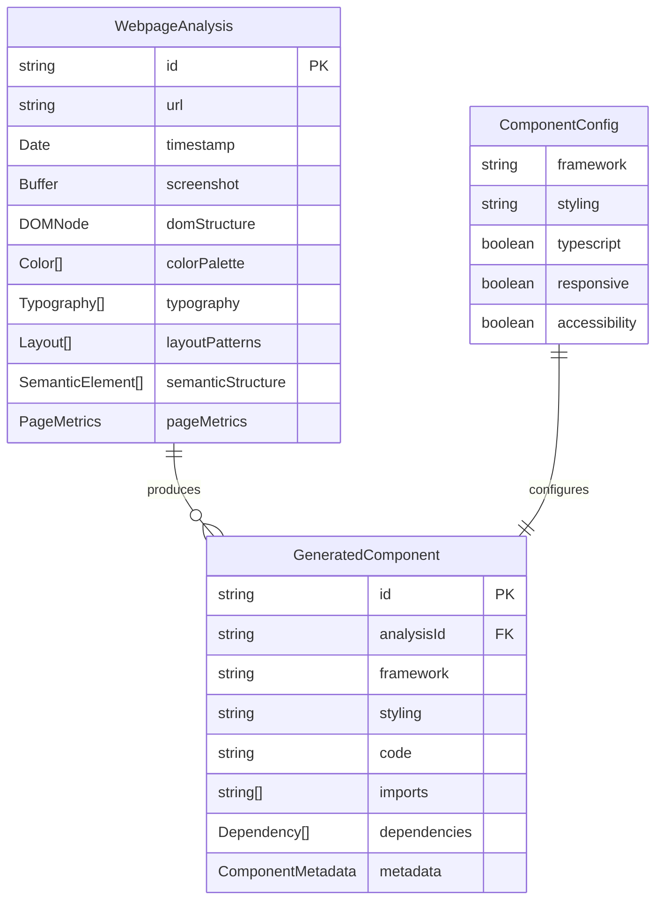

# Data Model Specification

**Feature**: Webpage to Component Analyzer
**Date**: 2025-10-01
**Version**: 1.0.0

## Entity Definitions

### WebpageAnalysis
Represents the extracted design information from a target webpage.

#### Fields
| Field | Type | Required | Description | Validation |
|-------|------|----------|-------------|------------|
| id | string | Yes | Unique analysis identifier | UUID v4 format |
| url | string | Yes | Source webpage URL | Valid HTTP/HTTPS URL |
| timestamp | Date | Yes | Analysis timestamp | ISO 8601 format |
| screenshot | Buffer | Yes | Full page screenshot | PNG format, max 10MB |
| domStructure | DOMNode | Yes | Hierarchical DOM tree | Valid HTML structure |
| colorPalette | Color[] | Yes | Extracted colors | Hex format (#RRGGBB) |
| typography | Typography[] | Yes | Font information | Valid CSS font properties |
| layoutPatterns | Layout[] | Yes | Spacing and alignment | CSS box model values |
| semanticStructure | SemanticElement[] | Yes | HTML5 semantic elements | Valid HTML5 tags |
| pageMetrics | PageMetrics | Yes | Performance metrics | Positive numbers |

#### State Transitions
- `pending` → `processing`: Analysis started
- `processing` → `completed`: Analysis successful
- `processing` → `failed`: Analysis error
- `failed` → `pending`: Retry initiated

### ComponentConfig
Represents user preferences for code generation.

#### Fields
| Field | Type | Required | Description | Validation |
|-------|------|----------|-------------|------------|
| framework | string | Yes | Target framework | Enum: react, angular, vue, svelte |
| styling | string | Yes | Styling approach | Enum: tailwind, css, scss, styled-components |
| typescript | boolean | No | Include TypeScript | Default: true |
| responsive | boolean | No | Mobile-first responsive | Default: true |
| accessibility | boolean | No | Include ARIA labels | Default: true |

### GeneratedComponent
Represents the output artifact containing component code.

#### Fields
| Field | Type | Required | Description | Validation |
|-------|------|----------|-------------|------------|
| id | string | Yes | Component identifier | UUID v4 format |
| analysisId | string | Yes | Source analysis ID | References WebpageAnalysis |
| framework | string | Yes | Component framework | From ComponentConfig |
| styling | string | Yes | Styling approach | From ComponentConfig |
| code | string | Yes | Generated component code | Non-empty string |
| imports | string[] | Yes | Required imports | Valid import statements |
| dependencies | Dependency[] | Yes | Package dependencies | NPM package format |
| metadata | ComponentMetadata | Yes | Generation metadata | Valid metadata object |

## Supporting Types

### DOMNode
```typescript
interface DOMNode {
  tagName: string;
  attributes: Record<string, string>;
  children: DOMNode[];
  textContent?: string;
  styles?: ComputedStyles;
}
```

### Color
```typescript
interface Color {
  hex: string;        // #RRGGBB format
  rgb: [number, number, number];
  usage: 'primary' | 'secondary' | 'accent' | 'background' | 'text';
  frequency: number;  // Occurrence count
}
```

### Typography
```typescript
interface Typography {
  fontFamily: string;
  fontSize: string;
  fontWeight: number;
  lineHeight: string;
  letterSpacing?: string;
  selector: string;   // CSS selector where used
}
```

### Layout
```typescript
interface Layout {
  selector: string;
  display: string;
  position: string;
  margin: string;
  padding: string;
  width?: string;
  height?: string;
  flexProperties?: FlexProperties;
  gridProperties?: GridProperties;
}
```

### SemanticElement
```typescript
interface SemanticElement {
  type: 'header' | 'nav' | 'main' | 'section' | 'article' | 'aside' | 'footer';
  selector: string;
  role?: string;
  ariaLabel?: string;
  children: string[];  // Child element selectors
}
```

### PageMetrics
```typescript
interface PageMetrics {
  domElements: number;     // Total DOM element count
  resourceSize: number;    // Total resources in bytes
  loadTime: number;        // Page load time in ms
  renderTime: number;      // First paint time in ms
  viewportWidth: number;   // Capture viewport width
  viewportHeight: number;  // Capture viewport height
}
```

### Dependency
```typescript
interface Dependency {
  name: string;
  version: string;
  type: 'production' | 'development';
}
```

### ComponentMetadata
```typescript
interface ComponentMetadata {
  generatedAt: Date;
  generationTime: number;  // Time taken in ms
  llavaVersion: string;
  codellamaVersion: string;
  templateVersion: string;
}
```

## Relationships



## Data Constraints

### URL Validation
- Must be valid HTTP or HTTPS protocol
- Cannot be localhost or private IP ranges
- Maximum length: 2048 characters
- No file:// or data: URLs

### Size Limits
- Screenshot: Maximum 10MB
- Generated code: Maximum 1MB
- DOM structure: Maximum 500 elements (per spec)
- Color palette: Maximum 20 distinct colors

### Performance Requirements
- Analysis must complete within 30 seconds
- Cache TTL: 24 hours for identical URLs
- Maximum 3 concurrent analyses

## Cache Strategy

### Cache Key Generation
```typescript
function getCacheKey(url: string, config: ComponentConfig): string {
  const normalized = normalizeUrl(url);
  const configHash = hashConfig(config);
  return `${normalized}:${configHash}`;
}
```

### Eviction Policy
- Algorithm: Least Recently Used (LRU)
- Maximum cache size: 1GB
- Maximum entries: 100
- TTL: 24 hours

## Error States

### Analysis Errors
- `INVALID_URL`: URL validation failed
- `UNREACHABLE_URL`: Cannot access webpage
- `TIMEOUT`: Analysis exceeded 30 seconds
- `DOM_TOO_LARGE`: More than 500 elements
- `RESOURCE_TOO_LARGE`: More than 10MB resources

### Generation Errors
- `UNSUPPORTED_FRAMEWORK`: Invalid framework selection
- `UNSUPPORTED_STYLING`: Invalid styling approach
- `AI_MODEL_ERROR`: LLaVA or CodeLlama failure
- `TEMPLATE_ERROR`: Template generation failed
- `VALIDATION_ERROR`: Generated code validation failed

## Migration Notes

This is the initial data model (v1.0.0). Future versions may:
- Add support for component composition (breaking monolithic requirement)
- Include animation/transition extraction
- Support additional frameworks or styling approaches
- Add versioning for generated components