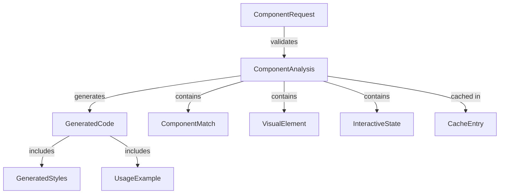

# Data Model Specification

**Feature**: Webpage Component Extractor
**Version**: 1.0.0
**Date**: 2025-10-01

## Overview

This document defines the data structures and relationships for the webpage component extraction tool. All models are designed to support MCP protocol requirements and maintain clear separation between request, analysis, and generation phases.

## Core Entities

### 1. ComponentRequest
**Purpose**: Validates and structures incoming extraction requests

```typescript
interface ComponentRequest {
  // Required fields
  url: string;                    // Valid HTTP/HTTPS URL
  identifier: ComponentIdentifier; // How to find the component
  framework: 'react' | 'vue';     // Target framework

  // Optional fields
  styling?: 'css' | 'scss' | 'css-in-js'; // Default: 'css'
  timeout?: number;                // Page load timeout (ms), default: 30000
  includeComputedStyles?: boolean; // Default: user choice
  viewport?: {
    width: number;  // Default: 1920
    height: number; // Default: 1080
  };
}

interface ComponentIdentifier {
  type: 'selector' | 'semantic';
  value: string; // CSS selector or semantic description
}
```

**Validation Rules**:
- URL must be valid HTTP/HTTPS format
- URL must not require authentication (returns error if detected)
- Timeout must be between 1000-60000ms
- Viewport dimensions must be positive integers

### 2. ComponentAnalysis
**Purpose**: Intermediate analysis results from visual and DOM inspection

```typescript
interface ComponentAnalysis {
  // Component identification
  matches: ComponentMatch[];      // All matching components found
  selectedIndex?: number;          // User-selected match (if multiple)

  // Visual analysis
  screenshot: ScreenshotData;      // Isolated component image
  visualHierarchy: VisualElement[]; // LLaVA-analyzed structure

  // DOM analysis
  domStructure: DOMNode;          // Extracted DOM tree
  computedStyles: StyleMap;       // All computed CSS properties
  originalStyles: StyleMap;       // Author-defined styles only

  // Interactive states
  states: InteractiveState[];     // Hover, focus, active captures
  eventHandlers: string[];        // Detected event types

  // Resources
  dependencies: ResourceDependency[]; // Fonts, images, icons
}

interface ComponentMatch {
  selector: string;               // Precise CSS selector
  confidence: number;             // 0-1 match confidence
  preview: string;                // Base64 thumbnail
  description: string;            // Human-readable description
}

interface VisualElement {
  type: string;                   // Component type from LLaVA
  bounds: Rectangle;              // Position and size
  children: VisualElement[];      // Nested components
  properties: Record<string, any>; // Visual properties
}

interface InteractiveState {
  trigger: 'hover' | 'focus' | 'active' | 'checked';
  styles: StyleMap;               // Style differences
  screenshot?: string;            // Visual capture if different
}
```

**State Transitions**:
1. Initial → Analyzing (page loading)
2. Analyzing → Matches Found (components identified)
3. Matches Found → Selected (user choice or single match)
4. Selected → Extracted (analysis complete)

### 3. GeneratedCode
**Purpose**: Final generated component code with metadata

```typescript
interface GeneratedCode {
  // Core output
  framework: 'react' | 'vue';
  componentName: string;          // PascalCase name
  code: string;                   // Complete component code

  // Styling
  styles: GeneratedStyles;        // Framework-appropriate styles

  // Metadata
  imports: string[];              // Required imports
  props?: PropDefinition[];       // Component props/inputs
  events?: EventDefinition[];     // Emitted events

  // Quality metrics
  completeness: number;           // 0-1 score
  warnings: string[];             // Non-fatal issues

  // Usage
  usage: UsageExample;            // How to use component
  dependencies: PackageDependency[]; // npm packages needed
}

interface GeneratedStyles {
  type: 'css' | 'scss' | 'css-in-js';
  content: string;                // Style definitions
  className?: string;             // Root class name
}

interface UsageExample {
  import: string;                 // Import statement
  jsx: string;                    // Example usage
  props?: Record<string, any>;   // Example prop values
}
```

**Generation Rules**:
- Component names must be valid JavaScript identifiers
- All code must be syntactically valid
- No placeholder content or TODOs
- Must include all necessary imports

## Supporting Types

### Cache Entities

```typescript
interface CacheEntry {
  key: string;                    // URL + identifier hash
  timestamp: number;              // Creation time
  expiry: number;                 // TTL timestamp
  data: ComponentAnalysis;       // Cached analysis
  size: number;                   // Bytes
}

interface CacheMetrics {
  hits: number;
  misses: number;
  evictions: number;
  currentSize: number;            // Total bytes
  maxSize: number;                // 1GB limit
}
```

### Error Entities

```typescript
interface StructuredError {
  code: string;                   // Error code
  message: string;                // User-friendly message
  details?: Record<string, any>; // Additional context
  suggestion?: string;            // Recovery action
}

// Standard error codes
enum ErrorCode {
  INVALID_URL = 'INVALID_URL',
  AUTH_REQUIRED = 'AUTH_REQUIRED',
  COMPONENT_NOT_FOUND = 'COMPONENT_NOT_FOUND',
  TIMEOUT = 'TIMEOUT',
  AI_ANALYSIS_FAILED = 'AI_ANALYSIS_FAILED',
  UNSUPPORTED_FRAMEWORK = 'UNSUPPORTED_FRAMEWORK'
}
```

## Relationships



## Data Flow

1. **Request Phase**:
   - ComponentRequest validated
   - Check cache for existing analysis
   - Initialize browser if needed

2. **Analysis Phase**:
   - Load page with Puppeteer
   - Identify components via selector/semantic
   - Capture screenshots and states
   - Extract DOM and styles
   - Send to LLaVA for visual analysis

3. **Generation Phase**:
   - Combine visual and DOM analysis
   - Select appropriate template
   - Generate code via CodeLlama
   - Format and validate output

4. **Response Phase**:
   - Return GeneratedCode
   - Update cache if successful
   - Log metrics

## Constraints

- Maximum 3 concurrent ComponentAnalysis operations
- Cache entries expire after 24 hours
- Screenshot size limited to 10MB
- Generated code must be under 50KB
- Component names must be unique per session

## Migration Notes

This is the initial data model version. Future versions may:
- Add support for additional frameworks (Angular, Svelte)
- Include component composition analysis
- Add version tracking for generated components
- Support component library integration

---

*Based on requirements from spec.md and constitutional principles*